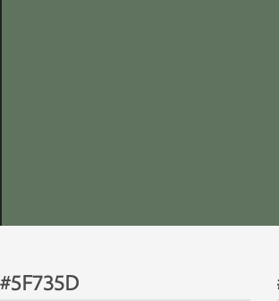

<h1 align="center"> Walk Locally</h1>

[View the live project here.](https://danielmichael82.github.io/walk_locally-MS2/)

This is the website for Walk Locally, a walking project that aims to help users discover their local area and stay active, whether that be solo, with a group of friends or as a family.

# Table of contents

- [UX](#User-Experience)
    - [Owners Business Goals](#owners-business-goals)
    - [User stories](#user-stories)
        - [First Time User Goals](#first-time-user-goals)
        - [Returning User goals](#returning-user-goals)
        - [Frequent User Goals](#frequent-user-goals)
    - [Design](#design)
        - [Colour Scheme](#colour-scheme)
        - [Typography](#typography)
        - [Imagery](#imagery)
    - [Wireframes](#wireframes)
- [Features](#features)
- [Technology Used](#technology-used)
    - [Languages Used](#languages-used)
    - [Frameworks, Libraries & Programs Used](#frameworks-libraries-programs-used)
- [Testing](#testing)
    - [Functionality Testing](#functionality-testing)
    - [Compatibility Testing](#compatibility-testing)
    - [Testing User Stories](#testing-user-stories)
        - [First Time User Testing](#first-time-user-testing)
        - [Returning User Testing](#returning-user-testing)
        - [Frequent User Testing](#frequent-user-testing)
    - [Further Testing](#further-testing)
    - [Known Bugs](#known-bugs)
- [Deployment](#deployment)
    - [GitHub Pages](#github-pages)
- [Credits](#credits)
    - [Code](#code)
    - [Content](#content)
     - [Media](#media)
     - [Acknowledgements](#acknowledgements)

## User Experience (UX)

#### Owners Goals

1. As the owner of the website, I want this website to help encourage the public to seek out their local area and enjoying this places with friends and family.

2. As the owner of the website, I want to be able to present a clean and easy to navigate website that focus' on a mobile experience for when the user is out and about.

3. As the owner of the website, I want engagement with user to understand what they want from the the website to help with future implementations.

4. As the owner of the website, I want the site to be able to offer routes of their preferred walk.

5. As the owner of the website, I would like our users but connect with us on our social media platforms. 

## User stories

#### First Time User Goals

1. As a first-time user to the site, I want to understand the main purpose of the site and discover the walking routes in my local area.

2. As a first-time user to the site, I want to be able to easily navigate throughout the site to find content.

3. As a first-time user to the site, I want to see clear information and photos locations available. 

4. As a first-time user to the site, I also want to locate their social media links to help with the choice of walk I take.
        
#### Returning User Goals

1. As a returning user, I want more information of the walk that I ultimatly take with pictures.

2. As a returning user, I want to be able to know my way around the site.

3. As a returning user, 

4. As a returning user, 

#### Frequent User Goals

1. As a Frequent User, I want to see more walking routes added.

2. As a Frequent User, I want to feel like I am apart of a community.

3. As a Frequent User, 

## Design

#### Colour Scheme

   **#5F735D** is the main color of the site, I feel that this color is a great repesentation of the walking theme.

   **#96B593** is the secondary color of the site, this color is a shade that compliments **#5F735D** and helps the burger menu and other buttons standout.

#### Typography

The Lato is the main font used throughout the site with Sans Serif as the fallback font in case for any reason the font isn't being imported into the site correctly. Open-Sans.

#### Imagery

Imagery is important. The large, hero image is designed to be striking and catch the user's attention. It also calls out community to me and this want I wanted to bring to the home page.

#### Wireframes

<h2 align="center"></h2>

## Features

## Navigation bar

- Navigation bar is visible on the top left hand-side of each page. The navigation bar is responsive and will adapt to mobile devices and tablets by a change into a burger menu.
- Navigation scheme:

    - On left side there is a logo. 
    - Next to the logo there are three links or burger menu which contains:
        - Home
        - Locations
        - Contact
    - On right side there are social media icon links.
        - Facebook
        - Instagram
        - Snapchat
        - Twitter
        
## Footer

- 

## Home

### Image Carousel

- The bootstrap image carousel is placed under the navigation bar, which cycles through walking styled images.

### 

- 

## Location

- Location offers the user to select the area in which they wish to walk, This area will include a Google Maps API showing the local area with markers for localised walks.

## Contact

- Contact form is where most of the links lead to. The user can contact Walk Locally by filling in the form with First Name, Last Name, Email Address
and a message box for any questions required.  This section uses JSemail integration when submitting a form.

## Future Implementations

1. 
2. 
3. 
4. 
5. 

## Technologies Used

### Languages Used

-   [HTML5](https://en.wikipedia.org/wiki/HTML5)
-   [CSS3](https://en.wikipedia.org/wiki/Cascading_Style_Sheets)
-   [Javascript](https://en.wikipedia.org/wiki/Javascript)

### Frameworks, Libraries & Programs Used

1. [Bootstrap 4.6.0:](https://getbootstrap.com/docs/4.6/getting-started/introduction/)
    - Bootstrap was used to assist with the responsiveness and styling of the website.
1. [Google Fonts:](https://fonts.google.com/)
    - Google fonts were used to import the 'Lato' font into the style.css file which is used on all pages throughout the project.
1. [Font Awesome:](https://fontawesome.com/)
    - Font Awesome was used on all pages throughout the website to add icons for aesthetic and UX purposes.
1. [jQuery:](https://jquery.com/)
    - jQuery came with Bootstrap to make the navbar responsive but was also used for the smooth scroll function in JavaScript.
1. [GitPod:](https://gitpod.io/)
    - GitPod was used for version control by utilizing the Gitpod terminal to commit and push to GitHub.
1. [GitHub:](https://github.com/)
    - GitHub is used to store the projects code after being pushed from Git.
1. [Tinyjgp:](https://tinyjpg.com/)
    - Tinyjpg was used for resizing images
1. [Imaging Edge:](https://imagingedge.sony.net/en-gb/ie-desktop.html)
    - Imaging Edge was used to resize and edit all of the images on the site.
1. [Autodesk Sketchbook:](https://apps.apple.com/gb/app/autodesk-sketchbook/id883738213#?platform=ipad)
    - Autodesk Sketchbook was used to create the company logo.
1. [Balsamiq:](https://balsamiq.com/)
    - Balsamiq was used to create the [wireframes]() during the design process.
1. [Chrome DevTools:](https://developers.google.com/web/tools/chrome-devtools)
    - Chrome DevTools have massively assisted me during the build of this site, helping with fixes to my code and positioning of elements.

## Testing

### Functionality Testing 

 I used Chrome DevTools throughout the project for testing and solving problems with responsiveness and style issues.

### Compatibility Testing
 Site was tested across multiple virtual mobile devices and browsers. I checked all supported devices in Chrome DevTools. 
 
 I tested on hardware devices such as: Desktop, MacBook Pro 13, iPad 11.2, iPhone 8, iPhone 11 and Samsung a71.

### User stories

#### First Time User Testing

1. As a first-time user to the site, 
2. As a first-time user to the site, 
3. As a first-time user to the site,  

#### Returning User Testing

1.    As a returning user, 
2.	  As a returning user, 
3.    As a returning user, 
4.    As a returning user, 

#### Frequent User Testing

1. As a Frequent User, 
2. As a Frequent User, 
3. As a Frequent User, 

### Further Testing

-   
-   
-   
-   

### Known Bugs

-   

## Deployment

### GitHub Pages

The project was deployed on GitHub Pages. I used Gitpod as a development environment where I commited all changes to git version control system.
I used push command in Gitpod to save changes into GitHub.

To deploy a project I had to:

- Log in to GitHub and click on repository to deploy [MS2](https://github.com/DanielMichael82/walk_locally-MS2)
- Select `Settings` and find GitHub Pages section at the very bottom of the page
- From source select `none` and then `Master` branch.
- Click `Save` and page was deployed after auto-refresh.
>  Your site is published at https://danielmichael82.github.io/walk_locally-MS2//

To run localy:
* Log in to GitHub and click on repository to download [MS2](https://github.com/DanielMichael82/walk_locally-MS2)
* Select `Code` and click Download the ZIP file.
* After downloading you can extract the file and use it in your local environment.

## Credits

- To complete this project I used Code Institute student template: [gitpod full template](https://github.com/Code-Institute-Org/gitpod-full-template)

- Ideas and knowledge library:

    - [w3schools.com](https://www.w3schools.com)

    - [getbootstrap.com/docs](https://getbootstrap.com/docs/4.6/getting-started/introduction/)
       

### Code

-   [Bootstrap4](https://getbootstrap.com/docs/4.6/getting-started/introduction/): Bootstrap Library used throughout the project mainly to make site responsive using the Bootstrap Grid System.

-   [W3 Validator]

-   [W3C CSS Jigsaw](https://jigsaw.w3.org/css-validator/validator

### Content

-   All content was written by the developer.

### Media

-   All images were created by the developer.

### Acknowledgements

-   My Mentor Adegbenga Adeye for helpful feedback throughout the project.

-   Tutor support at Code Institute for their support.

### Screenshots

## Project screenshots

<h2 align="center"></h2>

<h2 align="center"></h2>

<h2 align="center"></h2>

<h2 align="center"></h2>

<h2 align="center"></h2>

<h2 align="center"></h2>

[Back to Table of contents](#table-of-contents)

