<h1 align="center"> Walk Locally</h1>

[View the live project here.](https://danielmichael82.github.io/walk_locally-MS2/)

This is the website for Walk Locally, a walking project that aims to help users discover their local area and stay active, whether that be solo, with a group of friends or as a family.

# Table of contents

- [UX](#User-Experience)
    - [Owners Goals](#owners-goals)
    - [User stories](#user-stories)
        - [First Time User Goals](#first-time-user-goals)
        - [Returning User goals](#returning-user-goals)
        - [Frequent User Goals](#frequent-user-goals)
    - [Design](#design)
        - [Colour Scheme](#colour-scheme)
        - [Typography](#typography)
        - [Imagery](#imagery)
    - [Wireframes](#wireframes)
- [Features](#features)
- [Technology Used](#technology-used)
    - [Languages Used](#languages-used)
    - [Frameworks, Libraries & Programs Used](#frameworks-libraries-programs-used)
- [Testing](#testing)
    - [Functionality Testing](#functionality-testing)
    - [Compatibility Testing](#compatibility-testing)
    - [Testing User Stories](#testing-user-stories)
        - [First Time User Testing](#first-time-user-testing)
        - [Returning User Testing](#returning-user-testing)
        - [Frequent User Testing](#frequent-user-testing)
    - [Further Testing](#further-testing)
    - [Known Bugs](#known-bugs)
- [Deployment](#deployment)
    - [GitHub Pages](#github-pages)
- [Credits](#credits)
    - [Code](#code)
    - [Content](#content)
     - [Media](#media)
     - [Acknowledgements](#acknowledgements)

## User Experience (UX)

#### Owners Goals

1. As the owner of the website, I want this website to help encourage the public to seek out their local area and enjoying this places with friends and family.

2. As the owner of the website, I want to be able to present a clean and easy to navigate website that focus' on a mobile experience for when the user is out and about.

3. As the owner of the website, I want the site to be able to offer route suggestions of their preferred walk.

4. As the owner of the website, I would like our users but connect with us on our social media platforms. 

## User stories

#### First Time User Goals

1. As a first-time user to the site, I want to understand the main purpose of the site and discover the walking routes around the local area i am visiting.

2. As a first-time user to the site, I want to be able to easily navigate throughout the site to find content.

3. As a first-time user to the site, I want to see clear information and photo’s locations available. 

4. As a first-time user to the site, I would like to sign up to keep upto date with the website.

        
#### Returning User Goals

1. As a returning user, I want more information of the walk that I ultimatly take with pictures.

2. As a returning user, I want to be able to know my way around the site.

3. As a returning user, I also want to locate their social media links to help with the choice of walk I take.

#### Frequent User Goals

1. As a Frequent User, I want to add/suggest walking routes of my own.

2. As a Frequent User, I want the site to work perfectly on my mobile phone as I would use it if I was out walking.

## Design

#### Colour Scheme

   **#5F735D** is the main color of the site, I feel that this color is a great repesentation of the walking theme.

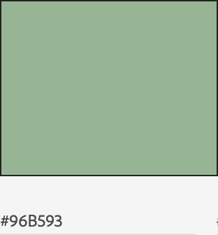   **#96B593** is the secondary color of the site, this color is a shade that compliments **#5F735D** and helps the burger menu and other buttons standout.

#### Typography

The Lato is the main font used throughout the site with Sans Serif as the fallback font in case for any reason the font isn't being imported into the site correctly. Open-Sans is also used throughout the site to support Lato.

#### Imagery

Imagery is important. The large, hero image is designed to be striking and catch the user's attention, I have added animations to emphasise this.

#### Wireframes

<h2 align="center">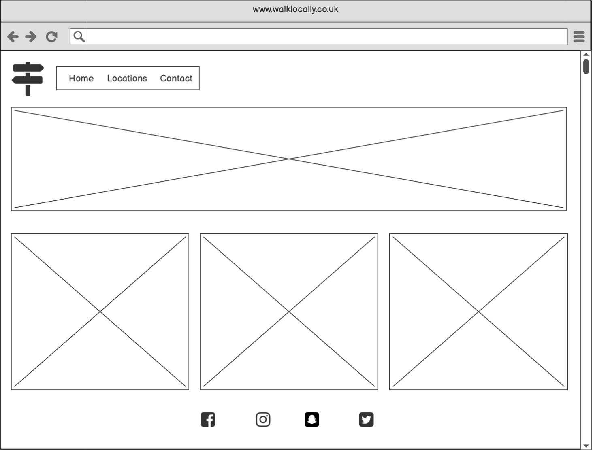</h2>
<h2 align="center">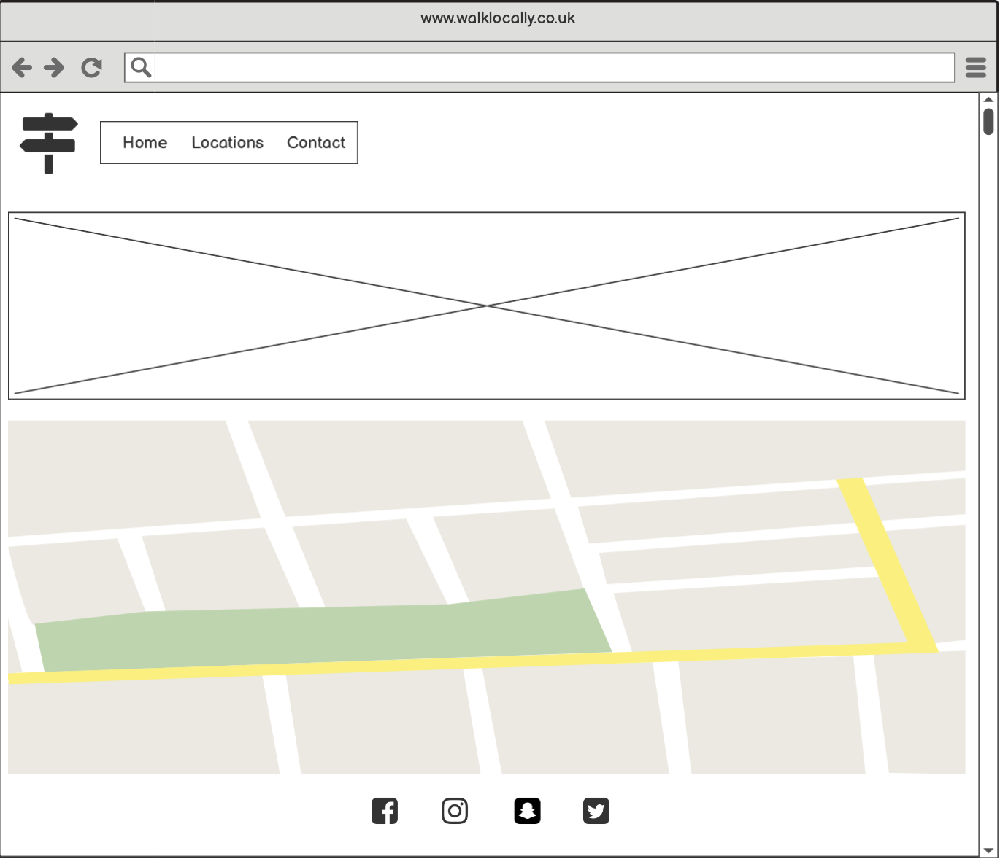</h2>
<h2 align="center">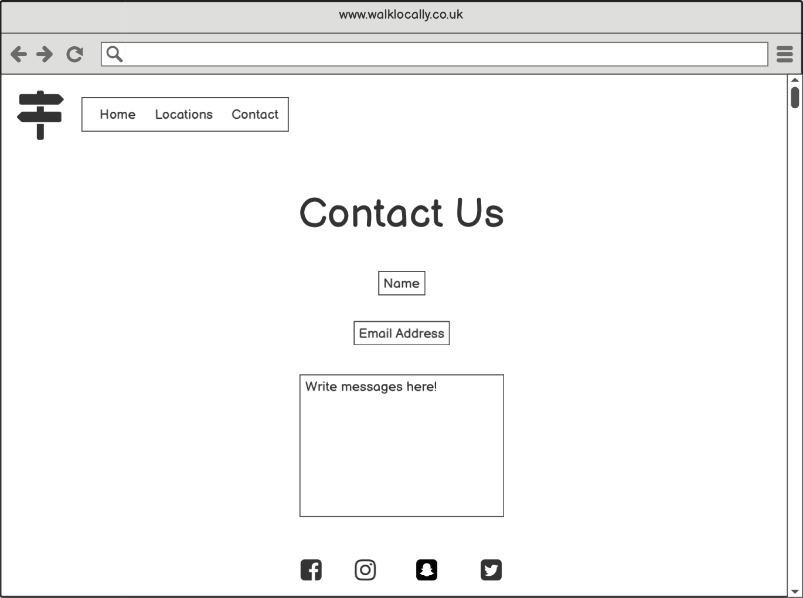</h2>
<h2 align="center">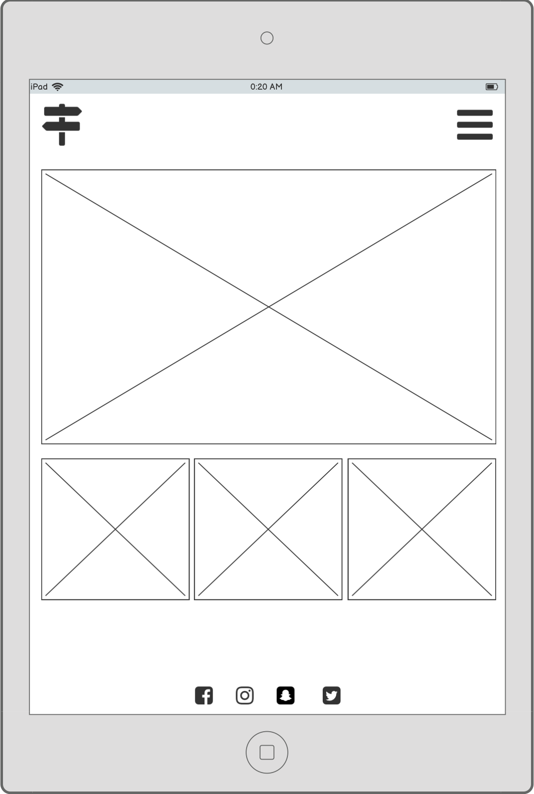</h2>
<h2 align="center">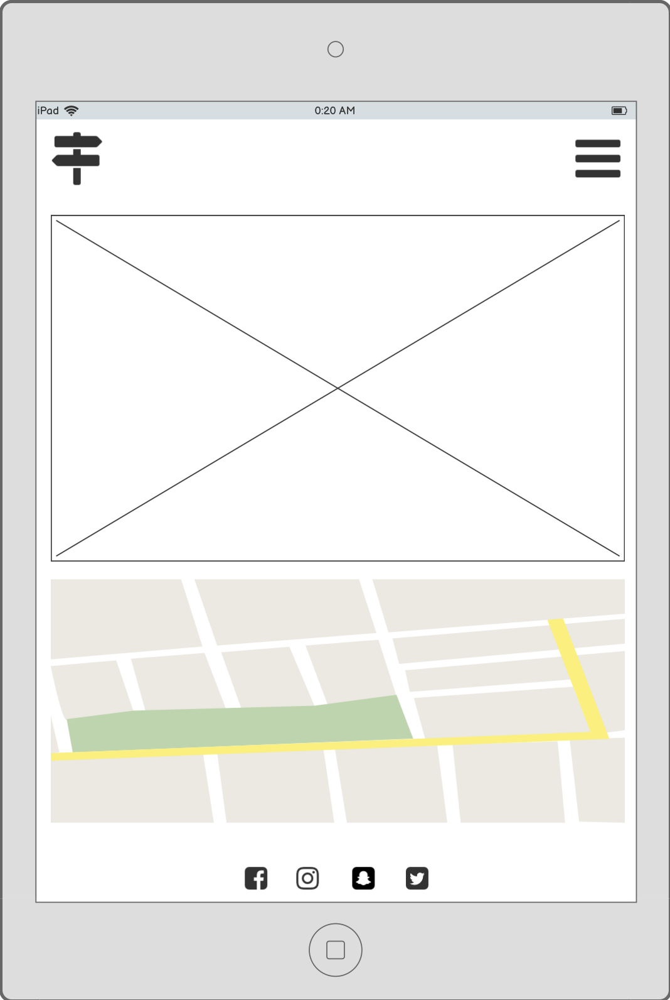</h2>
<h2 align="center">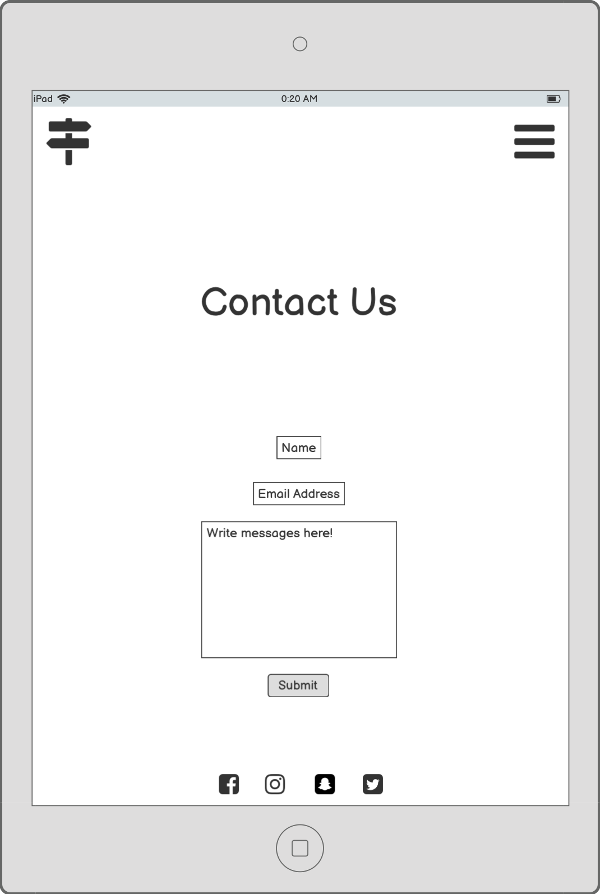</h2>
<h2 align="center">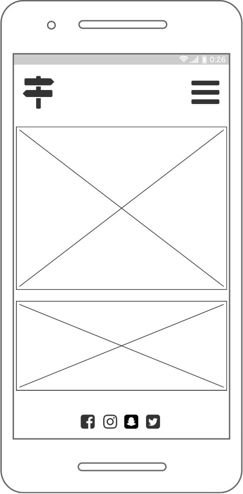</h2>
<h2 align="center">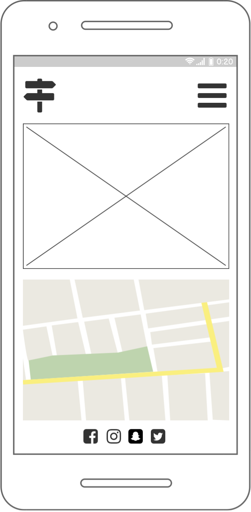</h2>
<h2 align="center">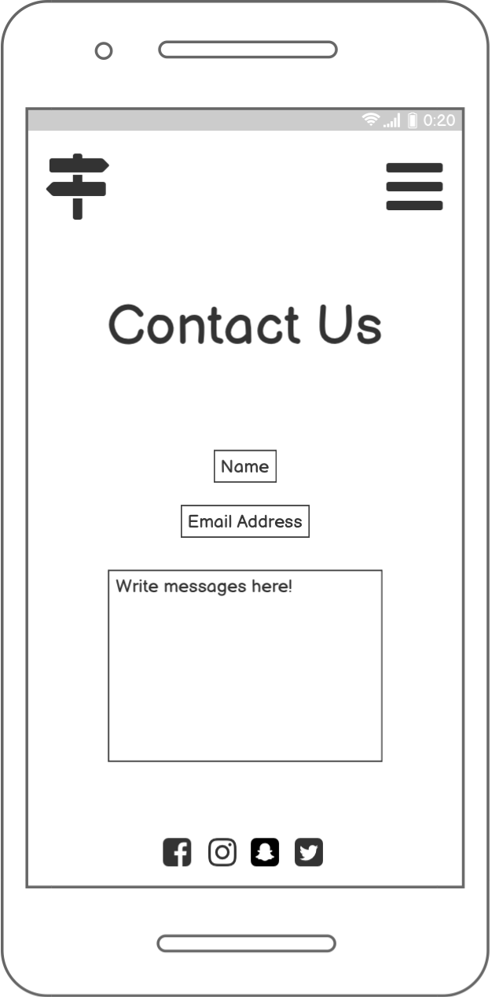</h2>

## Features

### Navigation bar

Navigation bar is visible on the top left hand-side of each page. The navigation bar is responsive and will adapt to mobile devices and tablets by a change into a burger menu.

- Navigation scheme:

    - On left side there is a logo. 
    - Next to the logo there are three links or burger menu which contains:
        - Home
        - Locations
        - Contact
        
## Footer

The footer displays social media site links for:

- Facebook
- Instagram
- Snapchat
- Twitter

## Home

### Animated Hero Image

On the home screen you will be greeted by and animated image with a large title in the middle, this is implementated on each page.

### Featured Cards

Consisting of 3 bootstrap image cards showing what the site offers the user.

## Location

Locations offers the user to select their marker in the area in which they wish to walk, using Google Maps API showing the location, as you click on the maker an info window appears with information of the location, walk and an image of the site selected. Click on the X in the top right-hand corner of the info window to close.

## Contact

Contact form is where most of the links lead to. The user can contact Walk Locally by filling in the form with First Name, Last Name, Email Address
and a message box for any questions required.  This section uses JSemail integration when submitting a form.

## Future Implementations

1. Closing the info-window in maps when clicking away from it.
2. A more detailed form users can suggest routes.
3. Detailed routes of the walks on maps.
4. Community meet-ups page with booking system.
5. Custom markers on map with company logo.

## Technologies Used

### Languages Used

-   [HTML5](https://en.wikipedia.org/wiki/HTML5)
-   [CSS3](https://en.wikipedia.org/wiki/Cascading_Style_Sheets)
-   [Javascript](https://en.wikipedia.org/wiki/Javascript)

### Frameworks, Libraries & Programs Used

1. [Bootstrap 4.6.0:](https://getbootstrap.com/docs/4.6/getting-started/introduction/)
    - Bootstrap was used to assist with the responsiveness and styling of the website.
1. [Google Fonts:](https://fonts.google.com/)
    - Google fonts were used to import the 'Lato' font into the style.css file which is used on all pages throughout the project.
1. [Font Awesome:](https://fontawesome.com/)
    - Font Awesome was used on all pages throughout the website to add icons for aesthetic and UX purposes.
1. [jQuery:](https://jquery.com/)
    - jQuery came with Bootstrap to make the navbar responsive but was also used for the smooth scroll function in JavaScript.
1. [GitPod:](https://gitpod.io/)
    - GitPod was used for version control by utilizing the Gitpod terminal to commit and push to GitHub.
1. [GitHub:](https://github.com/)
    - GitHub is used to store the projects code after being pushed from Git.
1. [Google Maps API:](https://developers.google.com/maps/documentation)
    - Google Maps API is integrated into locations.html.
1. [Tinyjgp:](https://tinyjpg.com/)
    - Tinyjpg was used for resizing images
1. [EmailJS:](https://www.emailjs.com/)
    - EmailJS was used to send email from the contact page using JavaScript
1. [Balsamiq:](https://balsamiq.com/)
    - Balsamiq was used to create the [wireframes]() during the design process.
1. [Chrome DevTools:](https://developers.google.com/web/tools/chrome-devtools)
    - Chrome DevTools have massively assisted me during the build of this site, helping with fixes to my code and positioning of elements.

## Testing

### Functionality Testing 

 I used Chrome DevTools throughout the project for testing and solving problems with responsiveness and style issues.

 ### HTML5

 I ran the code through [W3C Markup Validation](https://validator.w3.org/)
 <h2 align="center"></h2>

 ### CSS3

 I ran the code through [W3C CSS Validator](https://jigsaw.w3.org/css-validator/) errors and warnings are from Bootstrap and I am unable to resolve this.
 <h2 align="center">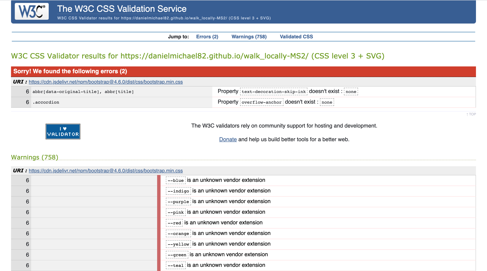</h2>

 ### JavaScript

 I ran the code through [JSHint](https://jshint.com/)
 <h2 align="center">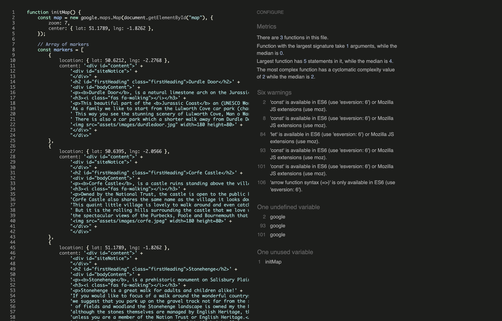</h2>
 <h2 align="center">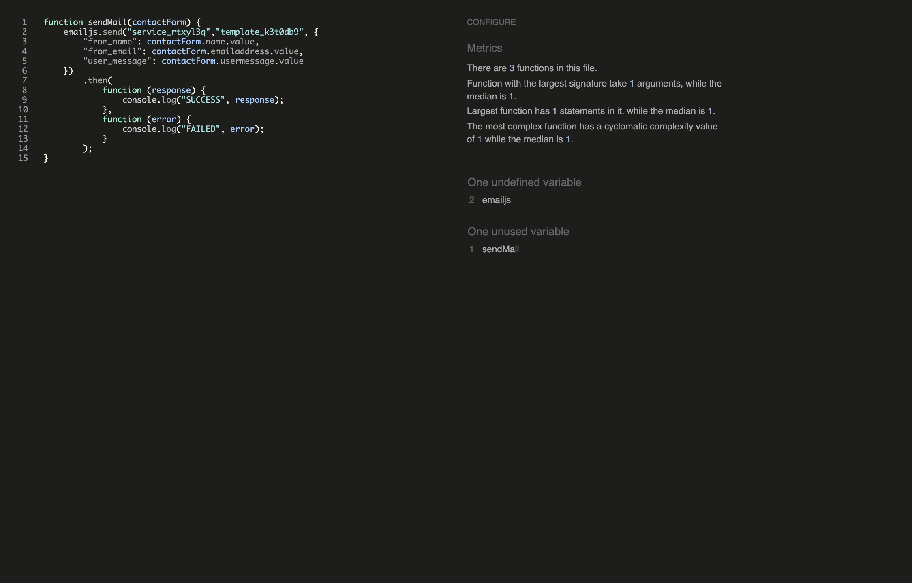</h2>
 

### Compatibility Testing
 Site was tested across multiple virtual mobile devices and browsers. I checked all supported devices in Chrome DevTools. 
 
 I tested on hardware devices such as: Desktop, MacBook Pro 13, iPad 11.2, iPhone 8, iPhone 11 and Samsung a71.

### User stories

#### First Time User Testing

1. As a first-time user to the site, I found the site to be very straightforward and I understand that Walk Locally is a website focused on walking in the local area that you are visiting.
2. As a first-time user to the site, I found the site very easy to navigate around when using my mobile and desktop.
3. As a first-time user to the site, I found that the site has a great variety of photos.
4. As a first-time user to the site, I like that it was easy to sign up and speak to Walk Locally directly with the message in the contact section.

#### Returning User Testing

1.    As a returning user, I felt that I didn't need to work my way around the site again, I knew what I wanted and where it was.
2.	  As a returning user, I really liked the pop-up window in maps that gives information of the area I am looking to visit.
3.    As a returning user, The social media links were easily found at the foot of each page.

#### Frequent User Testing

1. As a Frequent User, I really like the usage on mobile, in particular the animations.
2. As a Frequent User, I used the contact section to suggest a walking route in my local area.

### Further Testing

-   The website was tested on Google Chrome, Microsoft Edge and Safari browsers.
-   The website was viewed on a variety of devices such as Desktop, MacBook Pro 13, iPad 11.2, iPhone 11, iPhone 8 & Samsung a71.
-   A large amount of testing was done to ensure that all pages were linking correctly and looked great on all devices.
-   Friends and family have reviewed the site and highlighted any bugs and/or user experience issues.

### Known Bugs

-   When closing a info-window the user is only able to close down with the X in the top right hand corner of the info-window.  When clicking on others they overlay the other opened windows.

## Deployment

### GitHub Pages

The project was deployed on GitHub Pages. I used Gitpod as a development environment where I commited all changes to git version control system.
I used push command in Gitpod to save changes into GitHub.

To deploy a project I had to:

- Log in to GitHub and click on repository to deploy [MS2](https://github.com/DanielMichael82/walk_locally-MS2)
- Select `Settings` and find GitHub Pages section at the very bottom of the page
- From source select `none` and then `Master` branch.
- Click `Save` and page was deployed after auto-refresh.
>  Your site is published at https://danielmichael82.github.io/walk_locally-MS2//

To run localy:
* Log in to GitHub and click on repository to download [MS2](https://github.com/DanielMichael82/walk_locally-MS2)
* Select `Code` and click Download the ZIP file.
* After downloading you can extract the file and use it in your local environment.

## Credits

- To complete this project I used Code Institute student template: [gitpod full template](https://github.com/Code-Institute-Org/gitpod-full-template)

- Ideas and knowledge library:

    - [w3schools.com](https://www.w3schools.com)

    - [getbootstrap.com/docs](https://getbootstrap.com/docs/4.6/getting-started/introduction/)

    - [Google Maps API](https://developers.google.com/maps/documentation)
       

### Code

-   [Bootstrap4](https://getbootstrap.com/docs/4.6/getting-started/introduction/): Bootstrap Library used throughout the project mainly to make site responsive using the Bootstrap Grid System.

-   [W3 Validator](https://validator.w3.org/)

-   [W3C CSS Jigsaw](https://validator.w3.org/)

-   [Jasmine](https://jasmine.github.io/)

### Content

-   All content was written by the developer.

### Media

-   All images were created by the developer.

### Acknowledgements

-   My Mentor Adegbenga Adeye for helpful feedback throughout the project.

-   Tutor support at Code Institute for their support.

### Screenshots

## Project screenshots

<h2 align="center">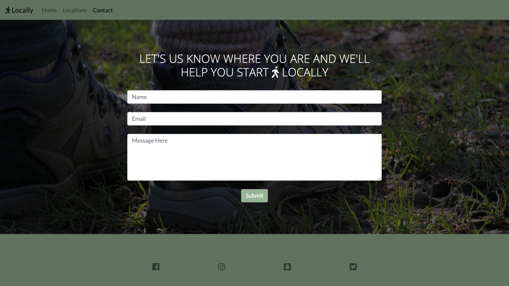</h2>

<h2 align="center">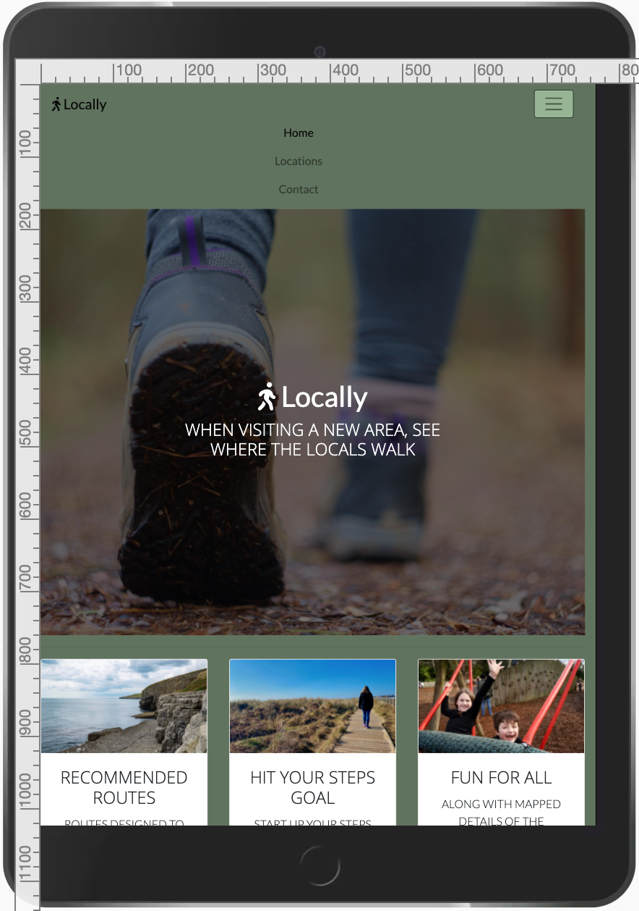</h2>

<h2 align="center">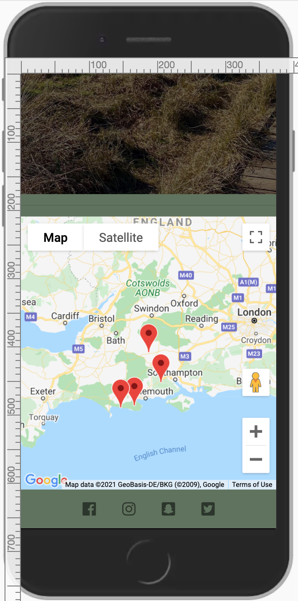</h2>

[Back to Table of contents](#table-of-contents)

